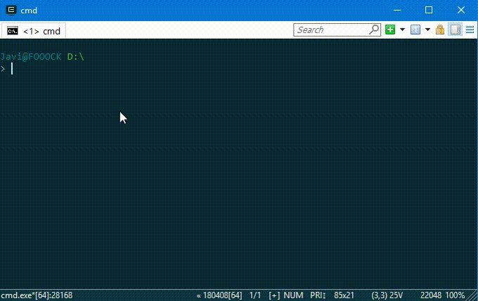
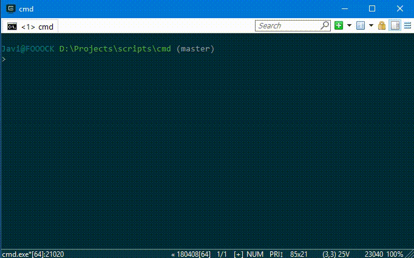

# Windows git prompt
Simple and useful script to show in the Windows 10 prompt the git branch
if you are on a `git` project.
> I'm using ConEmu as terminal



Another demo changing the git branch



## How I can install it?
Clone this repo
```bash
$ git clone https://github.com/fooock/windows-git-prompt.git
```

Now you need to run `regedit` to add a key. First go to
`HKEY_CURRENT_USER\Software\Microsoft\Command Processor` and add a 
entry with name `AutoRun`. Add the **full path** to the [envkey.cmd file](envkey.cmd) to the value.

If you are inside a git project you will be able to see the branch name 
in the prompt.

## How it works?
I created [this file](winrc.cmd) to modify the Windows prompt to show the branch name of the current git
project (if any). Then I created two `DOSKEY`, called `cd` and `git`:
```bash
DOSKEY cd=cd $* ^&^& %~dp0\winrc.cmd
DOSKEY git=git $* ^&^& %~dp0\winrc.cmd
```
> **Note** This line is the actuall content of [envkey.cmd](envkey.cmd) file

### References
* https://stackoverflow.com/questions/20530996/aliases-in-windows-command-prompt
* https://stackoverflow.com/questions/12028372/how-to-change-command-line-prompt-in-windows
* http://www.hanselman.com/blog/ABetterPROMPTForCMDEXEOrCoolPromptEnvironmentVariablesAndANiceTransparentMultiprompt.aspx
* http://ascii-table.com/ansi-escape-sequences.php

## License
```
The MIT License (MIT)

Copyright (c) 2018 Javi <nhitbh at gmail dot com>

Permission is hereby granted, free of charge, to any person obtaining a copy
of this software and associated documentation files (the "Software"), to deal
in the Software without restriction, including without limitation the rights
to use, copy, modify, merge, publish, distribute, sublicense, and/or sell
copies of the Software, and to permit persons to whom the Software is
furnished to do so, subject to the following conditions:

The above copyright notice and this permission notice shall be included in all
copies or substantial portions of the Software.

THE SOFTWARE IS PROVIDED "AS IS", WITHOUT WARRANTY OF ANY KIND, EXPRESS OR
IMPLIED, INCLUDING BUT NOT LIMITED TO THE WARRANTIES OF MERCHANTABILITY,
FITNESS FOR A PARTICULAR PURPOSE AND NONINFRINGEMENT. IN NO EVENT SHALL THE
AUTHORS OR COPYRIGHT HOLDERS BE LIABLE FOR ANY CLAIM, DAMAGES OR OTHER
LIABILITY, WHETHER IN AN ACTION OF CONTRACT, TORT OR OTHERWISE, ARISING FROM,
OUT OF OR IN CONNECTION WITH THE SOFTWARE OR THE USE OR OTHER DEALINGS IN THE
SOFTWARE.
```